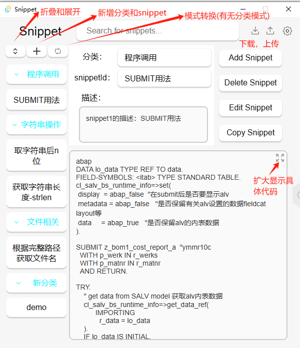

# mysnippet

#### 介绍
1. 一个简单的代码片段管理工具
2. 支持简单模式和管理模式
3. 支持gitee和gitHub的gist的代码片段管理（仅提供gist中单文件的下载和修改）
4. 以markdown格式书写 
5. 支持代码片段的搜索、分类、新增、修改、删除、复制等操作
6. 支持代码片段的本地存储、导入和导出
7. 支持本地自动保存


#### 软件架构
基于 typescript + tauri 开发的简单桌面应用
手撸的，没有使用前端框架
主要是以gist的api为基础进行开发的(仅使用了gist中单文件的获取和修改的api)
程序主要以typescript编写，仅仅使用了一点点tauri中的rust
本人非专业前端，仅作为学习和自我使用，所以写的很💩，欢迎大家提出建议和意见

#### 使用说明
本程序默认以本地存储的方式存储snippet
如果需要使用gitee或者github的gist的代码片段管理，需要先进行启用远端
同时先进行如下的操作：
初始操作：

1.  首次使用需要先登录gitee或者github
2.  登录成功后新建一个gist和token
3.  返回本软件，点击右上角的设置按钮，填写gist的id、token和片段文件名称
4.  点击保存

新建gist


最后点击保存即可
点击保存后 在浏览器中地址栏中最后一串字符就是gist的id
将它复制到设置中的snippet id中


新建token
新建完成后保存显示出现的token,
将该token填写在设置中的token栏中


设置界面
本地

远端


#### Snippet 格式说明

`##` 表示snippet 的分类
`###` 表示snippet 的标题
`%% %%` 表示snippet 的描述
` ``` ` 表示snippet 的代码


演示：
````text

## 程序调用
### SUBMIT用法
%%snippet1的描述：SUBMIT用法%%
``` abap
具体代码....
```

## 字符串操作
### 取字符串后n位
%%snippet2的描述：取字符串后n位%%
``` abap
具体代码.....
ENDFORM.
```

### 获取字符串长度-strlen
%%描述：获取字符串长度-strlen%%
``` abap
具体代码.....
```

## 文件相关
### 根据完整路径获取文件名
%%snippet3的描述：根据完整路径获取文件名%%
``` abap
具体代码.....
```

````


结果：


#### 功能说明



#### 演示

简单模式下的操作演示


#### 结尾

感兴趣或有问题的可以联系 simentw@126.com

也可以加入QQ群：821826969